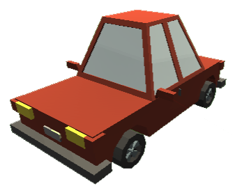

<h1 align="center">
   
  
   
  CarGame
   
</h1>

<h4 align="center">A game made with <a href="https://flutter.dev/" target="_blank">Unity</a></h4>

  <a href="#what-is-it">What it is</a> •
  <a href="#getting-started">Getting Started</a> •
  <a href="#preview">Preview</a> •

## What it is

This is a car game that I create with the Unity engine using models made with blender and free available prefabs on the Assets Store.

In this game, the user drives a car on the track in order to travel it in the shortest time possible.

On the display you can see the current, last and best recorded lap time.

Warning, cheating is not allowed in this game, if you skip the curve, the lap will not count. 

## Getting Started

### Via Unity

To run this project you must have unity installed (preferably version 2019 lts). 

Once you have it installed, you can open the project and click the play button.

### Via executable

Another way to run the game is using the .exe that is available in the executable folder.

## Preview

### Game Preview

